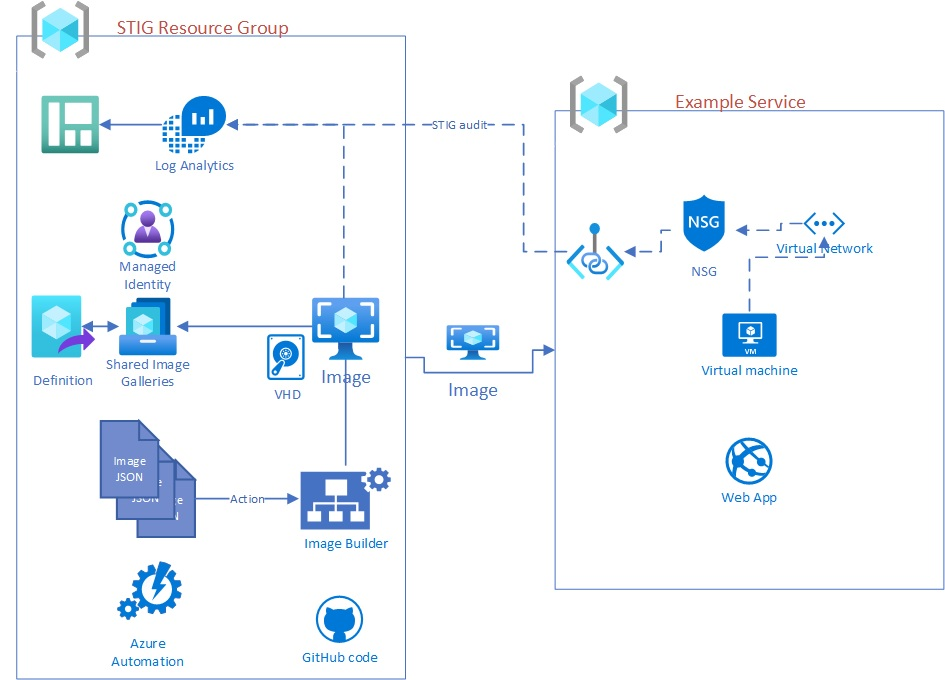
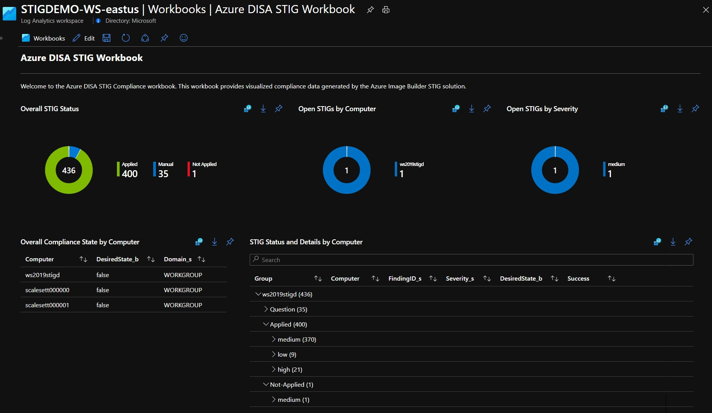

# Create Custom STIG Images

At Microsoft, our security and compliance story is one of our greatest differentiators. Microsoft recognizes the criticality of security compliance accreditations for Defense Industrial Base (DIB) and Department of Defense (DoD) customers. Maintaining Defense Information Systems Agency (DISA) Security Technical Implementation Guides (STIGs) compliance is critical and often time consuming. Azure provides automation and compliance dashboarding capabilities at cloud speed and scale, allowing customers to shortcut the heavy costs of compliance when they choose Azure.  


 


The Azure Team has created sample solutions using first-party Azure tooling to deliver STIG automation and compliance reporting. The STIG
Automation GitHub Repository, enables customers to: 

	
* Automate STIG implementation and baseline updates with Azure Image Builder  

	
* Visualize compliance with Azure Monitor Log Analytics or Sentinel 

## STIG Automation POC Primary Goals
- Microsoft Azure 1st party services
- Some level of ongoing reporting
- As hands free as possible
- Some level of ongoing maintenance

### Current Architecture


The overall architecture is to use a set of resources deployed via nested ARM templates from this repo. The result is an automated VM image creation via Azure Image Builder and final STIG'd images stored in the resource groups Shared Image Gallery for use in that subscription. Logging is the HTTPS ingestion API for Log Analytics and DSC Audit logs of PowerSTIG and it will not interfere with any agents monitoring for other purposes.

Basic resources used:

1. Shared Image Gallery
2. Image Definitions
3. Image Builder Templates
4. GitHub
5. Log Analytics Workspace
6. Azure Automation (for future use)
7. Managed Identity
8. Azure Workbook for Sentinel and Log Analytics

Resources used in the Image building and STIG process:

1. [PowerSTIG DSC]('https://github.com/microsoft/PowerStig') - STIG and Audit STIG
2. Custom scripts  
a. setPowerStig.ps1 = enables DSC and PowerSTIG requirements and creates scheduled task to audit for Windows  
b. audit.ps1 = Audits current state and parses state values to log for Windows  
c. Desired state MOF files, one for each image required  
d. Image Definition files, one for each

Resources used in the reporting and deployed as part of solution:
1. Log Analytics Wrokspace - logged telemtry varies per OS
2. 2 x Log Analytics workbooks, one for use in Sentinel.
3. Sentinel Solution - connects workspace to Sentinel   
*Note: Logging by default is over public network, for isolated systems please set up a [private link to Azure Monitor.]('https://docs.microsoft.com/en-us/azure/azure-monitor/platform/private-link-security')*


### Current supported OSes
See [Azure Image Builder](https://docs.microsoft.com/en-us/azure/virtual-machines/windows/image-builder-gallery "Azure Image Builder") for more support information on locations and customization services.
* Windows 10 RS5 Enterprise/Enterprise multi-session/Professional
* Windows 2016
* Windows 2019

Not yet supported by this project are:
* Ubuntu 18.04
* Ubuntu 16.04
* RHEL 7.6, 7.7, 8
* CentOS 7.6, 7.7, 8
* SLES 12 SP4
* SLES 15, SLES 15 SP1

### Getting Started

To deploy the correct resources that enable a base of STIG'd images be created in your subscription run the following:

Ensure you have the required resource registrations in your subscription:

```
Register-AzProviderFeature -FeatureName VirtualMachineTemplatePreview -ProviderNamespace Microsoft.VirtualMachineImages
Register-AzResourceProvider Microsoft.KeyVault
Register-AzResourceProvider Microsoft.VirtualMachineImages
Register-AzResourceProvider Microsoft.Compute
Register-AzResourceProvider Microsoft.Storage
```

```    
    $url = "https://raw.githubusercontent.com/shawngib/project-stig/master/azuredeploy.json"
    $imageResourceGroup = "<add the resource group name to create>" 
    $deploymentName = "<Add a name of deployment>" + (Get-Random)
    New-AzSubscriptionDeployment `
      -Name $deploymentName `
      -Location eastus `
      -TemplateUri $url `
      -rgName $imageResourceGroup `
      -rgLocation eastus `
      -DeploymentDebugLogLevel All
```

At this point you should have the needed resources to create STIG'd images. Run the following for each image template created that you wish an image to be created in the shared image gallery. This automation includes:
- Windows 10 STIG v1r23 - 'Win10WVDw365_STIG'
- Windows Server 2019 v1r5 - 'Win2019_STIG'
- Windows Server 2019 Domain Controller v1r5 - 'Win2019DC_STIG'
- Windows Server 2016 v1r12 - 'Win2016_STIG'
- Windows Server 2016 Domain Controller v1r12 - 'Win2016DC_STIG'

```
    Invoke-AzResourceAction `
      -ResourceName '<name of image>' ` # Eample: Win2019_STIG
      -ResourceGroupName '<name of resource group where templates are>' `
      -ResourceType Microsoft.VirtualMachineImages/imageTemplates `
      -ApiVersion "2020-02-14" `
      -Action Run `
      -Force
```
###
Once virtual machines are deployed they start to report in to the Log Analytics Workspace and the following workbook can be viewed:


### Ongoing Maintenance
While there is little to do ongoing outside of monitoring and reporting updated STIGs which are quarterly can be created by simply creating a MOF file as directed by PowerSTIG documentation and a new image template uploaded using [image builder]('https://docs.microsoft.com/en-us/azure/virtual-machines/windows/image-builder-gallery'). 

Specifically, when new STIG's are released or updated, you'll need do three things. 
- First create a MOF file which will be used by desired state configuration (DSC), one used for WS 2019 can be found [here]('https://github.com/shawngib/project-stig/blob/master/scripts/MOFcreation/WindowsServer2019v1r5.ps1'). It is a [PowerStig]('https://github.com/microsoft/PowerStig') DSC configuration script. Note: Pay close attention to naming convention of the configuration file since it will be the name of the output MOF file.
- create a new [image definition template]('https://docs.microsoft.com/en-us/azure/virtual-machines/linux/image-builder-json?toc=/azure/virtual-machines/windows/toc.json&bc=/azure/virtual-machines/windows/breadcrumb/toc.json'). An example can be found [here]('https://github.com/shawngib/project-stig/blob/master/imageTemplates/windows2019.json'). Note: the example template is designed to operate as a nested template for the solution but can be adapted to run separately with some modifications.


Sample PowerShell to upload the new image definition:
```
# Image gallery name
$sigGalleryName= "myIBSIG"

# Image definition name
$imageDefName ="winSvrimage"

# additional replication region
$replRegion2="eastus"

# Create the gallery
New-AzGallery `
   -GalleryName $sigGalleryName `
   -ResourceGroupName $imageResourceGroup  `
   -Location $location

# Create the image definition
New-AzGalleryImageDefinition `
   -GalleryName $sigGalleryName `
   -ResourceGroupName $imageResourceGroup `
   -Location $location `
   -Name $imageDefName `
   -OsState generalized `
   -OsType Windows `
   -Publisher 'myCompany' `
   -Offer 'WindowsServer' `
   -Sku 'WinSrv2019'
```


### Current Roadmap

As of 10/28/2020 this project is beta but in working order. You can find updates here as they are published.

##Copyright

Copyright (c) 2020 Microsoft Corporation. All rights reserved.